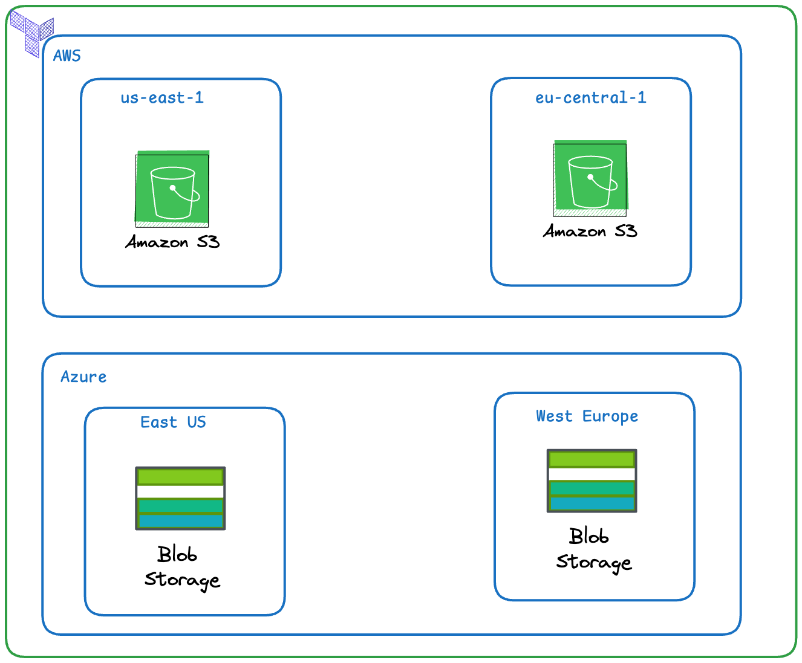

# Multi Cloud (AWS, Azure) and Multi Regions Infrastructures Provisioning With Terraform

Your company needs a resilient, cloud-agnostic “asset landing zone.” Product teams will later push build artifacts and static assets to whichever region/cloud is closest. Today’s goal is to establish the foundations, not the data flows.

## Requirements

- AWS: Create one S3 bucket in us-east-1 and one in eu-central-1.
- Azure: Create one Storage Account in the East US and one in West Europe, each inside its own Resource Group.
- Apply a clear naming convention that embeds the environment and region (e.g., company-dev-assets-use1, company-devassetsweu).
- Tag all resources with at least: project=multicloud-foundation, owner=<your-name>, env=dev.
- Enable basic durability settings you can locate in the registry (e.g., bucket versioning on S3, standard redundancy on Azure).

## Design



## Project Structures

```files
multi-cloud-multi-region
├── aws
│   ├── eu-central-1
│   └── us-east-1
├── azure
│   ├── east-us
│   └── west-europe
└── README.md
```

